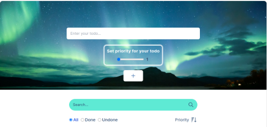

# ToDo App 🚀

[Live App](https://automaze-test.vercel.app/)

## Project Description

Welcome to the ToDo App repository! ToDo App is a simple and efficient TODO web application that allows you to manage your tasks seamlessly. Whether you need to create a new task, mark it as done, set priorities, or search for specific tasks, ToDo App has got you covered.

## 📋 Features

- **Task List:** View a comprehensive list of all your tasks.
- **Add and Remove Tasks:** Easily add new tasks to the list and remove completed tasks.
- **Search Functionality:** Search for tasks using a convenient search bar.
- **Mark as Done:** Mark tasks as done to keep track of your progress.
- **Filter by Status:** Filter tasks based on their status (all/done/undone).
- **Priority Assignment:** Assign priority to tasks on a scale from 1 to 10.
- **Sortable Tasks:** Sort tasks by priority in ascending or descending order.

## 🛠️ Technologies Used

- Backend: Node.js [GitHub Repository](https://github.com/Anna-Voronina/automaze-test-backend)
- Frontend: React with Next.js and Tailwind CSS
- Axios
- React Icons
- ESLint
- PropTypes

## 🚀 Getting Started

1. Clone the repository: `https://github.com/Anna-Voronina/automaze-test`
2. Navigate to the project directory: `cd automaze-test`
3. Install all dependencies: `npm install` or `yarn install`
4. Start the project: `npm run dev` or `yarn dev`
5. Access the application on: `http://localhost:3000`

## 🌐 Deployment

Optionally, the application is deployed using [Vercel](https://vercel.com/) at [https://automaze-test.vercel.app/](https://automaze-test.vercel.app/).

## 📝 Note for Developers

Please refer to the [backend repository](https://github.com/Anna-Voronina/automaze-test-backend) if you need to explore or modify the backend code.

## 🙌 Acknowledgments

ToDo App was built with passion and the desire to simplify task management. Hope you find it helpful and user-friendly.

Happy tasking! 🚀
